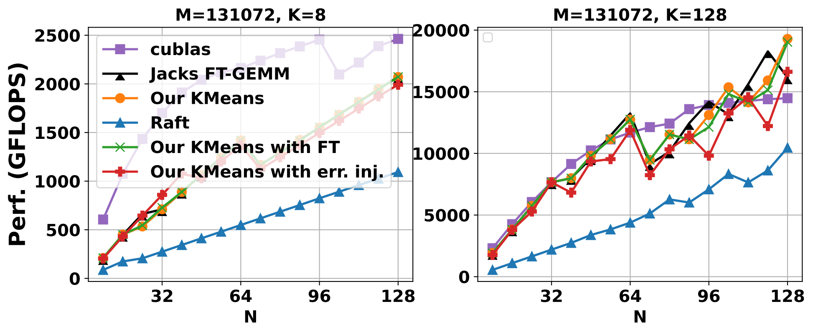
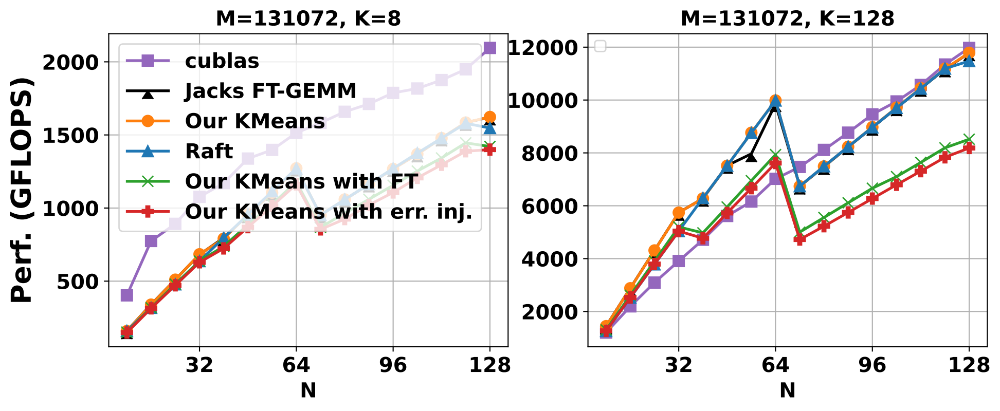
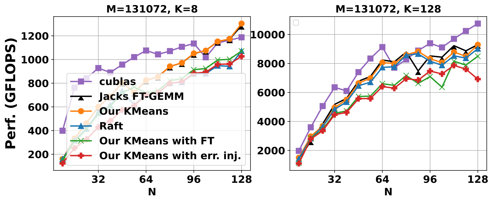

# FT K-Means: A High-Performance K-Means on GPU with Fault Tolerance
### How to compile and run tests for float and double versions

**Float version:**
- Source code: `src/test_kmeans_tuner.cu`
- Compile and run command: `make kmeans ./kmeans`

**Double version:**
- Source code: `src/test_kmeans_tuner_double.cu`
- Compile and run command: `make kmeansd ./kmeansd`

**Explanation of the code:**
Initially, based on previous test results, the first line in the main function of both codes defines a `bestnum` array. This array contains numbers indicating that the corresponding parameter number is the optimal parameter for at least one set of test data.

In each set of data tests, it starts with a for-loop to test all parameters in `bestnum`, identifying the maximum Gflops and corresponding Elapsed, which are recorded in `double max_gflops_r=0.0, min_elapsed_r=0.0`; the corresponding parameter number is stored in `int max_num = 0`. Then, it tests the Raft parameters (corresponding to the 0th group of parameters) as well as two selected parameters, which specific numbers are commented in the code.

At the end, there is a long output, printing the values of this set of input data, each's Gflops and elapsed times, and the selected parameter numbers, all separated by commas. Directly inputting this result into the corresponding Python file can generate the respective graph.

### How to modify the loops in the code to match the generated graphs
This is also written in the comments of the code, which generally look like this:
```cpp
    // chosen parameters:
    // Parameter1. 42
    // Parameter2. 18
    // When K is fixed:
    //  for (IdxT k=8; k<=128; k*=16)
    //      for (IdxT n = 8; n <= 128; n+= 8)
    //
    // When N is fixed:
    //  for (IdxT n=8; n<=128; n*=16)
    //      for (IdxT k = 8; k <= 128; k += 8)
    //
    // The loop for heatmap
    //  for(IdxT n = 8; n <= 128; n += 8)
    //      for(IdxT k = 32; k <= 512; k += 32)
```
To run different experiments, just replace the two nested loops inside, then compile and run as needed.

---


### Benchmark Figures

This section describes the visual representations of the performance benchmarks used in our analysis. Each figure illustrates the behavior of the algorithm under different configurations and precision levels.

#### 32-bit Precision Figures:

*Figure: Benchmark results for K-means with fixed K using 32-bit precision.*


*Figure: Benchmark results for K-means with fixed N using 32-bit precision.*

#### 64-bit Precision Figures:

*Figure: Benchmark results for K-means with fixed K using 64-bit precision.*


*Figure: Benchmark results for K-means with fixed N using 64-bit precision.*

### Data Files Explanation

This section details the data files used in our experiments, specifically those involving fault tolerance (`ft` stands for fault tolerance) and error injection (`err` represents error injection scenarios).

#### Fault Tolerance Data Files:
- **jack_fp32_fixK_ft.csv** and **jack_fp32_fixN_ft.csv**: These files contain results for 32-bit floating-point precision with fixed values of K and N respectively, under fault tolerance conditions.
- **jack_fp64_fixK_ft.csv** and **jack_fp64_fixN_ft.csv**: Similar to the 32-bit versions, these files hold data for 64-bit precision tests, indicating fault tolerance performance for fixed values of K and N.
- **test_kmeans_fp32_fixK_ft.csv**, **test_kmeans_fp32_fixN_ft.csv**, **test_kmeans_fp32_ft.csv**: These files represent the fault tolerance results of different test configurations using 32-bit floating points.
- **test_kmeans_fp64_fixK_ft.csv** and **test_kmeans_fp64_fixN_ft.csv**: These files detail the 64-bit versions of the K-means tests under fault tolerance conditions.

#### Error Injection Data Files:
- **test_kmeans_fp32_err.csv**, **test_kmeans_fp32_fixK_err.csv**, and **test_kmeans_fp32_fixN_err.csv**: These files show the results from 32-bit floating-point precision tests where errors were intentionally injected to simulate faults.
- **test_kmeans_fp64_fixK_err.csv** and **test_kmeans_fp64_fixN_err.csv**: For the 64-bit tests, these files document the outcomes when errors are injected, with fixed values of K and N.

#### Regular Data Files:
- **cublas_fp32_fixK.csv** and **cublas_fp32_fixN.csv**: These datasets provide results from the CuBLAS library tests for 32-bit precision with fixed K and N values respectively.
- **cublas_fp64_fixK.csv** and **cublas_fp64_fixN.csv**: These correspond to the 64-bit precision tests using the CuBLAS library.
- **test_kmeans_fp32_fixK.csv** and **test_kmeans_fp32_fixN.csv**, **test_kmeans_fp64_fixK.csv** and **test_kmeans_fp64_fixN.csv**: These files provide the base results for the K-means tests with fixed K and N values in both 32-bit and 64-bit precisions.
